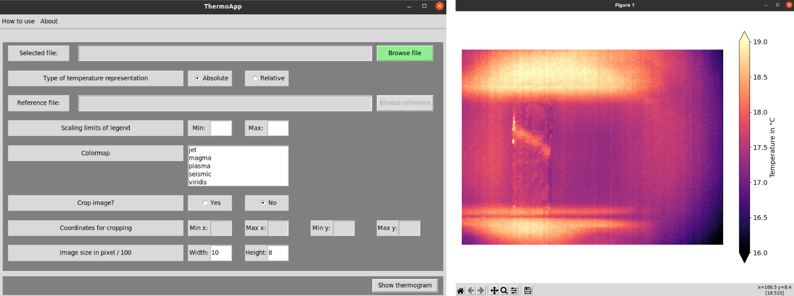

# ThermoApp

##Features
* GUI
* create thermograms from .TXT files which were exported through IRBIS 3 software package
* display absolute temperature or relative temperature change with regards to reference thermogram
* customize colormap, crop thermogram, select imagesize 

##Dependencies: 
* [python3](http://python.org)
* [matplotlib](http://matplotlib.org)
* [numpy](https://numpy.org/)
* [pandas](https://pandas.pydata.org/)
* [tkinter](https://docs.python.org/3/library/tkinter.html)

##How to use
* IDE: 
execute ```ThermoApp.py```
* Terminal:
execute ```python3 ThermoApp.py```
* For Windows users: Running ```ThermoApp.bat``` as admin works as well

##Screenshots

